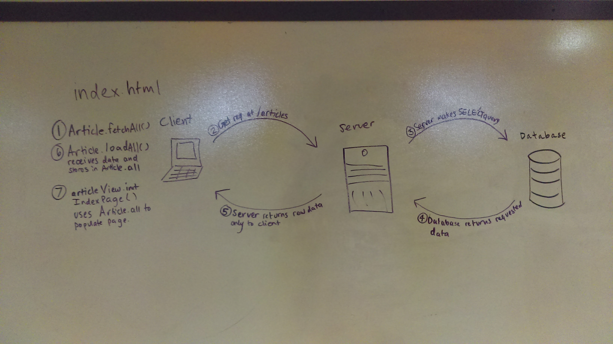
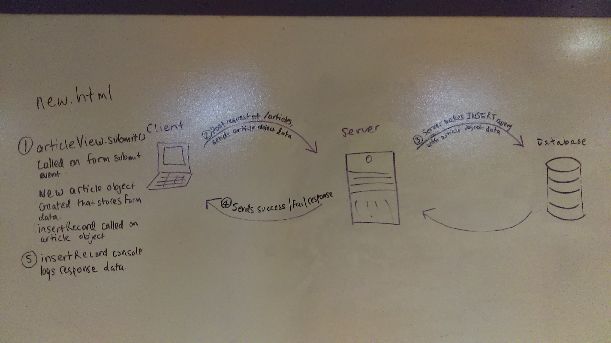

# Lab 08 Extension

## Stack Trace - Home

1. After loading jQuery and other external resources, and hoisting functions/variables/etc, Article.fetchAll(articleView.initIndexPage) is called in index.html.

- *No other client-side functions are run because Article.fetchAll immediately makes an Ajax request to the server.*

2. Article.fetchAll makes a get request to the server at /articles: Client makes get request to server > Server receives get request > Server queries database with SQL statement SELECT * FROM articles > Database returns results > Server returns results (row data only) to client > client calls Article.loadAll() with the results as a parameter.

- *The server receives the data in JavaScript notation that contains not only the rows themselves but also a lot of parameter data about the table fields, parsers, etc. The server specifically sends the row data in object notation back to the client.*

3. Article.loadAll() sorts the received data by publish date, and saves the resulting sorted data to Article.all.

4. Afterwards, client runs articleView.initIndexPage() to use the Article.all data to populate the page.

- *No other functions run after this point that make server calls, including functions called by user actions.*

## Stack Trace - New Article

1. After loading jQuery and other external resources, and hoisting functions/variables/etc, articleView.initNewArticlePage() is called in new.html.

2. Within articleView.initNewArticlePage(), client-side functions are run to populate page content and event handlers.

- *No functions run on load that interact with the server.*

3. (event handler) articleView.submit is called on form submit. This makes a server call: Client creates new object article that stores current field data > Client makes a post request to server at /articles, sends article object > Server queries database with SQL statement INSERT INTO articles... [article object data] > If success, server sends 'insert complete' as response to client; if fail, server sends 500 error as response to client > Client console logs response.

- *Additional functions exist that make other kinds of calls to the server, but they are not called in the flow of the page and can only be called from the browser console.*

